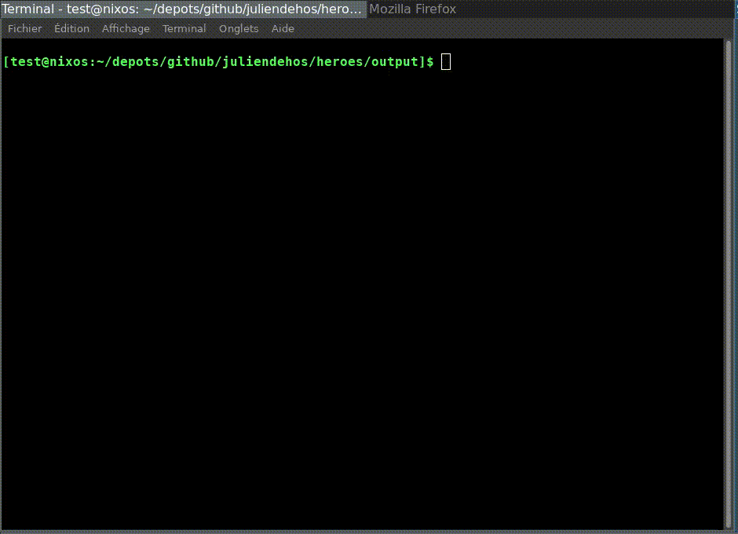

# heroes

Simple isomorphic web app using [Miso](https://github.com/dmjio/miso).



## Try using docker:

```
docker run --rm -it -p 3000:3000 juliendehos/heroes:latest
```

Then go to `localhost:3000`.


## Build and run:

```
nix develop .#wasm --experimental-features "nix-command flakes" --command bash -c "make"
nix develop --experimental-features "nix-command flakes" --command bash -c "cabal update && cabal build"
```

## Build and deploy in a `output` folder:

```
./build.sh
cd output
./app
```

## build a docker image:

```
./build-docker.sh
```

## References:

    - [https://github.com/haskell-miso/haskell-miso.org](https://github.com/haskell-miso/haskell-miso.org)
    - [https://gitlab.com/juliendehos/talk-2019-lillefp-miso/-/tree/master/heroes-1.0](https://gitlab.com/juliendehos/talk-2019-lillefp-miso/-/tree/master/heroes-1.0)

